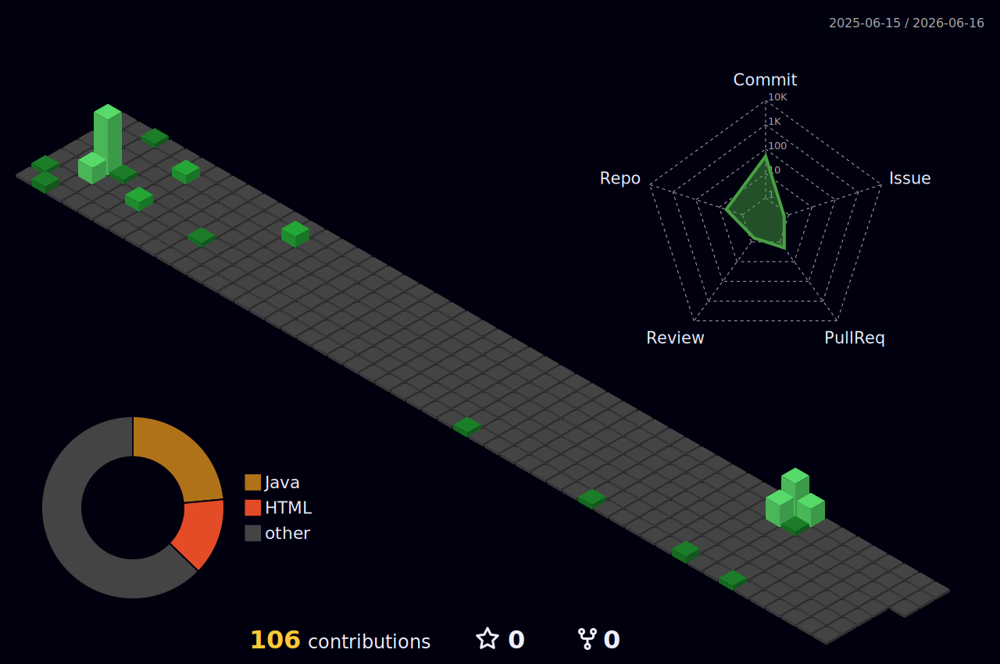

<div align="center">

```
╔══════════════════════════════════════════════════════════════╗
║                                                              ║
║   ░██████╗░██╗░█████╗░██╗░░██╗░░░  root@gioh-mkv            ║
║   ██╔════╝░██║██╔══██╗██║░░██║░░░  ─────────────────────    ║
║   ██║░░██╗░██║██║░░██║███████║░░░  OS     : Fedora Linux     ║
║   ██║░░╚██╗██║██║░░██║██╔══██║░░░  HOST   : ThinkPad         ║
║   ╚██████╔╝██║╚█████╔╝██║░░██║░░░  SHELL  : bash             ║
║   ░╚═════╝░╚═╝░╚════╝░╚═╝░░╚═╝░░░  FOCUS  : data + security  ║
║                                                              ║
╚══════════════════════════════════════════════════════════════╝
```

</div>

---

<div align="center">

### `> whoami`

</div>

```bash
$ cat about.txt

  Estudante de Ciência de Dados @ UFC
  Explorando as fronteiras entre IA, redes neurais e cibersegurança.
  Apaixonada por Linux, ThinkPads e pela filosofia do open source.
  
  Quando não estou debugando às 2h da manhã, estou lendo sobre
  análise técnica nos mercados financeiros ou me perdendo em
  light novels.
  
  Estado atual: compilando conhecimento. Sem erros... por enquanto.
```

---

<div align="center">

### `> ls -la /interests`

</div>

<div align="center">

| 🧠 IA & ML | 🔐 Cibersegurança | 🐧 Linux |
|:---:|:---:|:---:|
| Redes Neurais | Segurança Ofensiva | Fedora / Distro Hopping |
| Modelos Probabilísticos | Criptografia | Shell Scripting |
| Data Science | Análise de Vulnerabilidades | ThinkPad Gang |

</div>

---

<div align="center">

### `> cat stack.conf`

</div>

**Linguagens**


**IA / Data**


**Ambiente**


---

<div align="center">

### `> git log --oneline --graph /projects`

</div>

<div align="center">

[](https://github.com/gioh-mkv)
[](https://github.com/gioh-mkv)

</div>

> 💡 *Fixe seus repositórios no GitHub para que apareçam automaticamente aqui com os nomes corretos.*

---

<div align="center">

### `> neofetch --stats`

</div>

<div align="center">


</div>

<div align="center">


</div>

---

<div align="center">

### `> finger gioh-mkv`

</div>

<div align="center">

[](https://linkedin.com/in/)
[](https://gioh-mkv.github.io)
[](mailto:)

</div>

---

<div align="center">

```
╔═══════════════════════════════════════════════════╗
║  "Any sufficiently advanced technology is         ║
║   indistinguishable from magic."                  ║
║                              — Arthur C. Clarke   ║
╚═══════════════════════════════════════════════════╝
```


</div>


<!--## Hi there, I'm Giovanna - Data Scientist 👋

I am a Brazilian student in progress. I am an independent **cybersecurity** student and I am graduating in **Data Science** from the Federal University of Ceará.


- 🌱 I am currently participating in the ICT Residency Program - Capacita Jovem at the State University of Ceará; Cyber ​​Academy at Febraban; CIEE + Google Courses
- 💌 Contact me on my [email](mailto:giovannafnobrega@gmail.com)

Technologies I've been learning and using so far:

- Programming languages : <br />

  
  
  
  
  
- Machine Learning / Deep Learning frameworks : <br />

  
  
  
  
  
  

- Frontend : <br />

  
  
  

- Backend : <br />

  
  
  
  

    
- OS & IDE & Tools : <br />

  
  
    [](https://dinhanhthi.com/visual-studio-code)

- Other tools : <br />

  
  [](https://dinhanhthi.com/notes/#api-&-services)
  
  
  
  
  
  
  
  


<p align="center">
  <br/>
  <a href="https://github.com/gioh-mkv/github-readme-stats"></a>
  <a href="https://github.com/gioh-mkv/github-readme-stats"></a>
  <br/>
  <b>Note:</b> Top languages is only a metric of the languages my public code consists of and doesn't reflect experience or skill level.
</p>




**gioh-mkv/gioh-mkv** is a ✨ _special_ ✨ repository because its `README.md` (this file) appears on your GitHub profile.

Here are some ideas to get you started:

- 🔭 I’m currently working on ...
- 🌱 I’m currently learning ...
- 👯 I’m looking to collaborate on ...
- 🤔 I’m looking for help with ...
- 💬 Ask me about ...
- 📫 How to reach me: ...
- 😄 Pronouns: ...
- ⚡ Fun fact: ...
-->
